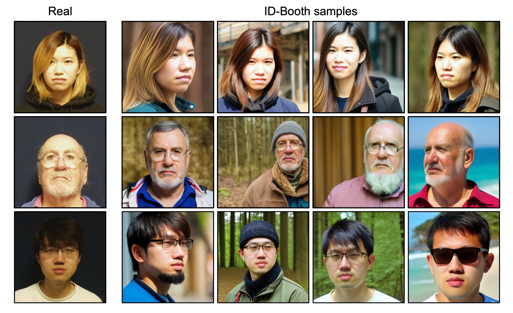
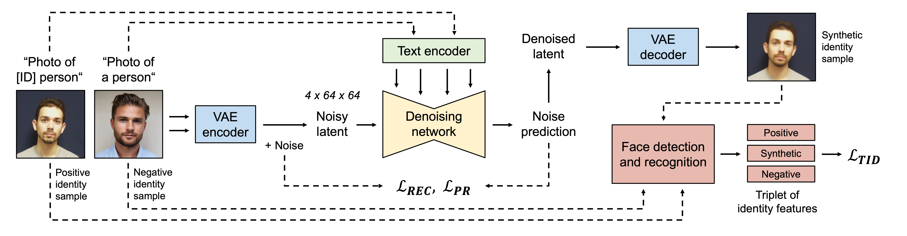

# ID-Booth: Identity-consistent Face Generation with Diffusion Models

<div align="center">
  Darian Tomašević, Fadi Boutros, Chenhao Lin, Naser Damer, Peter Peer, Vitomir Štruc
  <br>
  <br>
  <a href='https://arxiv.org/abs/2403.11641'></a>
  <br>
  <br>
</div>  
<div align="center">
        
</div>
This is the official implementation of the ID-Booth framework, which:

&emsp;🔥 generates in-the-wild images of consenting identities captured in a constrained environment <br>
&emsp;🔥 uses a triplet identity loss to fine-tune Stable Diffusion for identity-consistent yet diverse image generation <br>
&emsp;🔥 can augment small-scale datasets to improve their suitability for training face recognition models  <br>


## <div align="center"> Results </div>
<div align="center">
  <p>
    
  </p>
</div>

## <div align="center"> Framework </div>
<div align="center">
  <p>
    
  </p>
</div>

## <div align="center"> Setup </div>

```bash
conda create -n id-booth python=3.10
conda activate id-booth

# Install requirements
pip install -r requirements.txt
TODO
```


## Usage

To generate images of a desired identity with [Stable Diffusion 2.1](https://huggingface.co/stabilityai/stable-diffusion-2-1), load the corresponding fine-tuned LoRA weights with the [diffusers](https://huggingface.co/docs/diffusers/index) library:


```python


from diffusers import StableDiffusionPipeline
import torch
from torchvision.utils import save_image
from diffusers import DPMSolverMultistepScheduler
from diffusers import DDPMScheduler
from diffusers import AutoPipelineForText2Image
from itertools import product 


device = "cuda:0"
guidance_scale = 5.0
num_inference_steps = 30
width, height = 512, 512

base_model = "stabilityai/stable-diffusion-2-1-base"
lora_checkpoint =  "trained_lora_models/ID_1" 

prompt = f"face portrait photo of sks person"
negative_prompt = "cartoon, cgi, render, illustration, painting, drawing, black and white, bad body proportions, landscape"         
number_of_samples = 20

output_folder = "GENERATED_SAMPLES"

pipe = StableDiffusionPipeline.from_pretrained(model_architecture, torch_dtype=torch.float16).to(device)      
pipe.scheduler = DDPMScheduler.from_pretrained(model_architecture, subfolder="scheduler")
             
pipe.load_lora_weights(lora_checkpoint)
               
# TODO ... check if images can instantly be saved? 
for j in range(number_of_samples):  
  image = pipe(prompt=prompt, negative_prompt=negative_prompt, generator=generator, num_inference_steps=num_inference_steps, guidance_scale=guidance_scale, width=width, height=height)
  save_image(output, fp=f"{output_folder}/{i}_{j}_{prompt}.png")      

```
Fine-tuned weights for an example identity from the paper can be downloaded [here](TODO).
Results in the paper can be reproduced with data generated by [inference_ID-Booth.py](https://github.com/dariant/ID-Booth/blob/main/inference_ID-Booth.py).


## Training 
To fine-tune a model on a desired identity ... you can run the 
use identity embeddings extracted with pretrained ArcFace recognition model (TODO weights)

More information ... can be found in the train_


```
TODO
```


## Evaluation 
The experiments of the ID-Booth paper ... consist of three main parts. 

To evaluate the quality, fidelity and diversity of generated images, we rely on the following repositories:


Evaluation of quality and diversity is .. notebooks found in directories ". 

Notebooks and scripts for the experiments can also be found in the Evaluation directory. 


```
TODO
```


## Citation

If you use the code or results from this repository, please cite the ID-Booth paper:

```
TODO Add reference
```

## Acknowledgements

Supported in parts by the Slovenian Research and Innovation Agency ARIS through the Research Programmes P2-0250(B) "Metrology and Biometric Systems" and P2--0214 (A) “Computer Vision”, the ARIS Project J2-2501(A) "DeepBeauty" and the ARIS Young Researcher Program.


